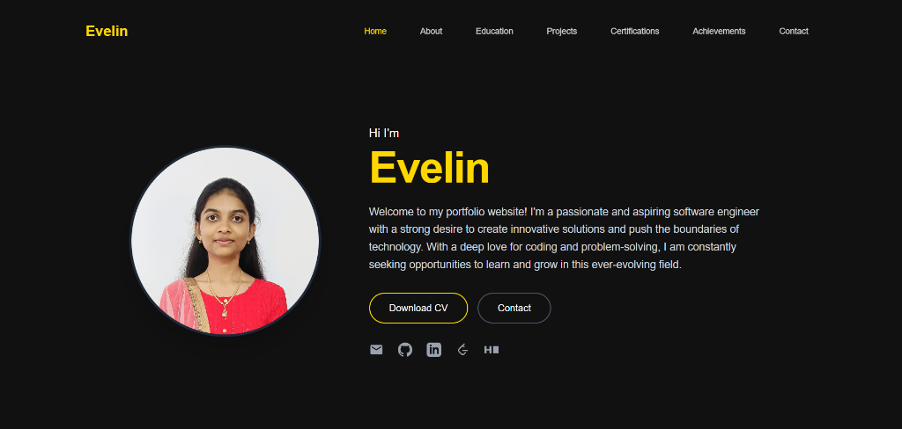

# 🌟 Personal Portfolio Website

A modern, responsive, and dynamic portfolio website built with the MERN stack (MongoDB, Express.js, React, Node.js). This full-stack application showcases my projects, achievements, certifications, and professional journey as a software engineer.

## ✨ Features

### 🎨 Frontend Features
- **Responsive Design**: Mobile-first approach with seamless experience across all devices
- **Modern UI/UX**: Clean, professional interface with smooth animations and transitions
- **Dynamic Content**: Real-time data fetching from backend API
- **Interactive Components**: Engaging user interactions with hover effects and transitions
- **Section Navigation**: Easy navigation between different portfolio sections

### 📂 Key Sections
- **Hero Section**: Eye-catching introduction with profile image and call-to-action
- **About Me**: Comprehensive overview of skills, technologies, and professional background
- **Education**: Academic journey and qualifications
- **Projects**: Showcase of 5+ major projects with live demos and GitHub links
- **Certifications**: Professional certifications and course completions (10+ certificates)
- **Achievements**: Awards and recognitions organized by category
  - 🥇 First Place Awards (6)
  - 🥈 Second Place/Runners Up (6)
  - 📜 Participation & Appreciation (6)
  - ⚽ Sports Achievements (6)
- **Contact**: Functional contact form with social media integration

### 🔧 Backend Features
- **RESTful API**: Clean API architecture for projects, achievements, and contact management
- **MongoDB Integration**: Scalable database for dynamic content storage
- **Contact Form Handler**: Email notifications for contact submissions
- **CORS Enabled**: Secure cross-origin resource sharing
- **Environment Variables**: Secure configuration management

## 🛠️ Tech Stack

### Frontend
- **React 18** - UI library for building component-based interfaces
- **Tailwind CSS** - Utility-first CSS framework for responsive design
- **Axios** - HTTP client for API requests
- **React Router DOM** - Client-side routing

### Backend
- **Node.js** - JavaScript runtime environment
- **Express.js** - Web application framework
- **MongoDB** - NoSQL database
- **Mongoose** - MongoDB object modeling
- **Nodemailer** - Email sending functionality
- **dotenv** - Environment variable management

### Development Tools
- **Vite** - Fast build tool and development server

## 📸 Screenshots

### Home Page


### Achievements Section
Organized achievements showcasing academic, technical, and sports excellence with 24+ certificates.

### Projects Gallery
Interactive project cards with live demos and GitHub repository links.

## 🚀 Getting Started

### Prerequisites
- Node.js (v14 or higher)
- MongoDB (local or Atlas)
- npm or yarn package manager

### Installation

1. **Clone the repository**
```bash
git clone https://github.com/727623BIT053Evelin/PortFolio_MERN_Project.git
cd PortFolio_MERN_Project
```

2. **Install Backend Dependencies**
```bash
cd server
npm install
```

3. **Install Frontend Dependencies**
```bash
cd ../client
npm install
```

4. **Environment Variables**

Create a `.env` file in the `server` directory:
```env
PORT=5000
MONGODB_URI=your_mongodb_connection_string
EMAIL_USER=your_email@gmail.com
EMAIL_PASS=your_gmail_app_password
```

### Running the Application

1. **Start MongoDB** (if running locally)
```bash
mongod
```

2. **Start Backend Server**
```bash
cd server
npm run dev
```
Backend will run on `http://localhost:5000`

3. **Start Frontend Development Server**
```bash
cd client
npm run dev
```
Frontend will run on `http://localhost:5173`

## 📁 Project Structure

```
Portfolio_MERN_Project/
├── client/                    # Frontend React application
│   ├── public/               # Static assets and certificates
│   ├── src/
│   │   ├── components/       # React components
│   │   │   ├── Hero.jsx
│   │   │   ├── About.jsx
│   │   │   ├── Education.jsx
│   │   │   ├── Projects.jsx
│   │   │   ├── Certifications.jsx
│   │   │   ├── Achievements.jsx
│   │   │   ├── Contact.jsx
│   │   │   └── ...
│   │   ├── App.jsx          # Main app component
│   │   ├── main.jsx         # Entry point
│   │   └── index.css        # Global styles
│   ├── package.json
│   └── vite.config.js
│
├── server/                   # Backend Node.js application
│   ├── controllers/         # Request handlers
│   ├── models/              # MongoDB schemas
│   ├── routes/              # API routes
│   ├── server.js            # Server entry point
│   ├── package.json
│   └── .env.example         # Environment variables template
│
└── README.md
```

## 🔐 Security Features

- Environment variables for sensitive data
- CORS configuration
- Input sanitization
- Secure password handling for email


## 👤 Author

**Evelin J**

- GitHub: [@727623BIT053Evelin](https://github.com/727623BIT053Evelin)
- Email:evelin710lin@gmail.com

## 🤝 Contributing

Contributions, issues, and feature requests are welcome! Feel free to check the [issues page](https://github.com/727623BIT053Evelin/PortFolio_MERN_Project/issues).

## ⭐ Show your support

Give a ⭐️ if you like this project!

## 📞 Contact

For any queries or suggestions, feel free to reach out through the contact form on the website or via email.

---

